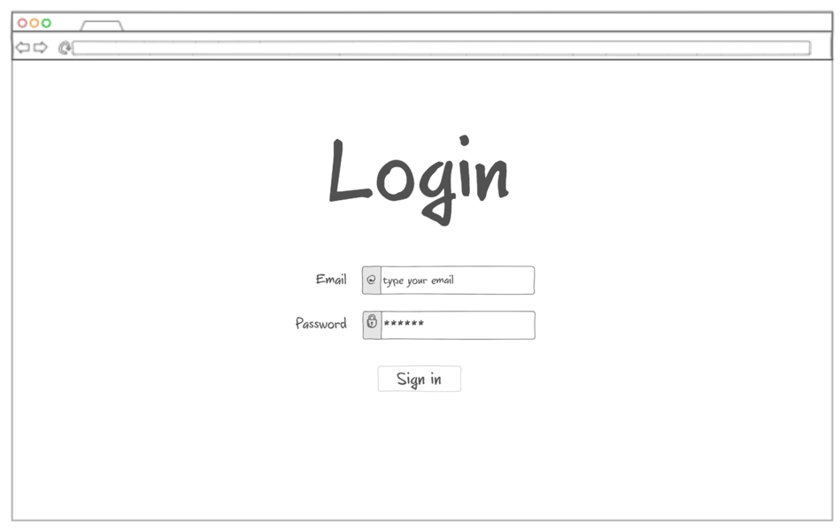
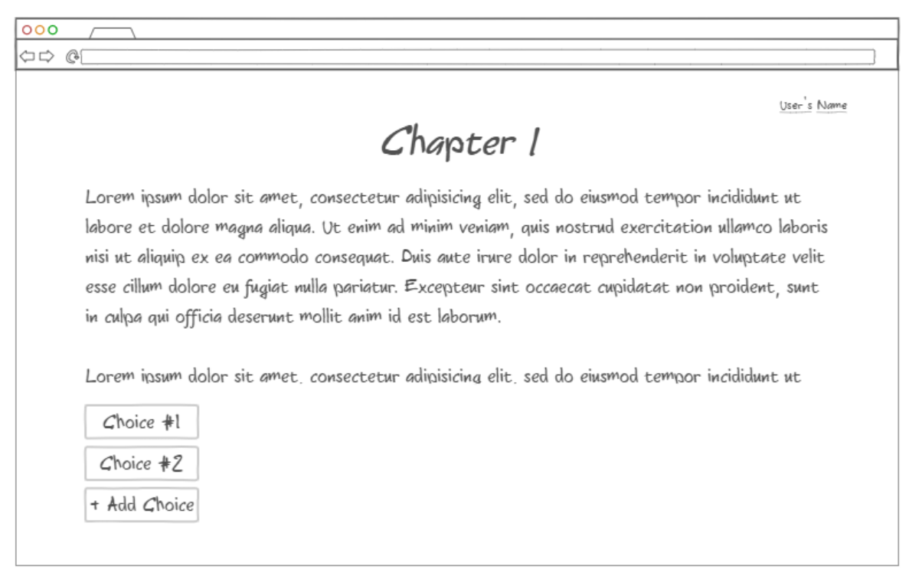
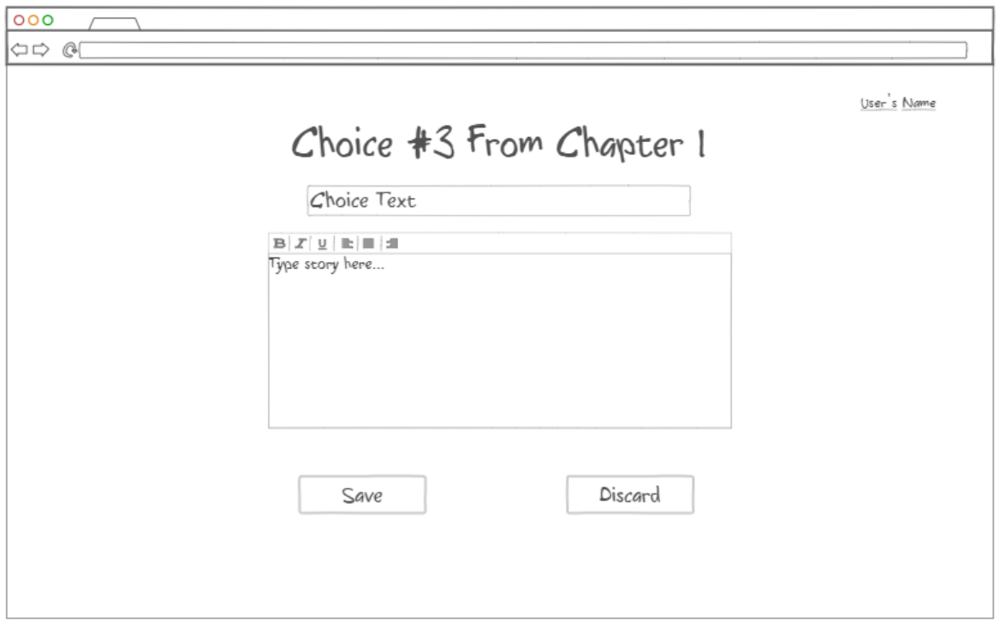
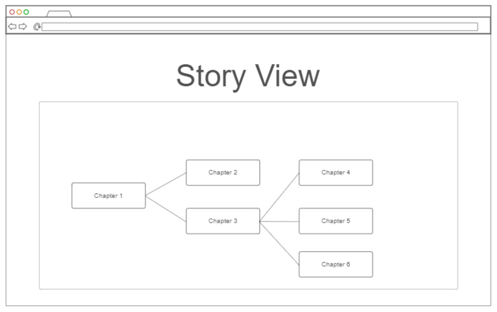
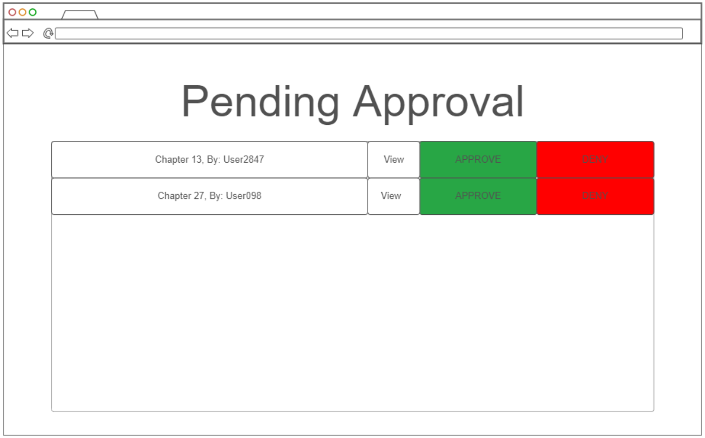
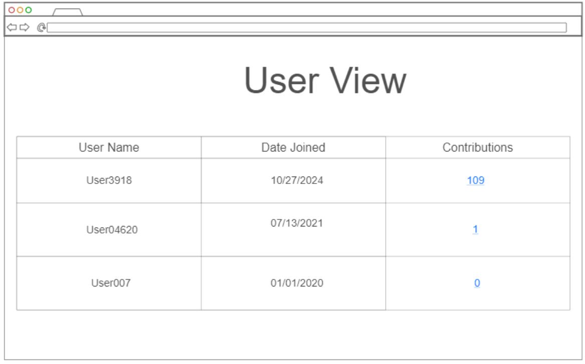

# RPG Collaborative Text Application

## Description deliverable

NOTE: This is an extension of my previous 260 project. I only completed about 50% of the course's material. This pitch aims to build on the foundation and add additional features, along with the technologies that were never implemented the first time. For comparison, the previous project page can be found [here]( https://github.com/tss67/StartUpProject).

### Elevator pitch

The RPG Collaborative Text Application is a cooperative writing experience that takes inspiration from the gamebooks of the 80s and 90s (Choose Your Own Adventure, Lone Wolf, Fighting Fantasy, etc.). In such stories, the reader is an active participant who can make decisions that change the outcome of the story. In this application, users will all contribute to the same massive story, adding decisions and endings along the way. Anyone can create an account, add a new choice, and begin writing. Without the limitations of being a physical book, this application is free to grow and develop far beyond the scope of any of the gamebooks of old while encouraging creativity and cooperation. Additionally, I aim to create a few admin tools to monitor and manage the growth and development of the website.

### Design

Login Page

Reading Page

Story Addition Page

Story View Admin Page

Pending Approval Admin Page

User View Admin Page

### Key features

- Ability to securely login
- Ability to read and play through the story so far
- Ablility to add choices, write new sections, and link up to existing portions of the story 
- Current story updated in realtime
- Current story and choice connections persistently stored
- Ability for admins to view pending story additions and approve or deny them
- Ability for admins to manage exising story elements, including a view to see the enture story created thus far
- Ability for admins to see contributions by user

### Technologies

Here are the technologies I will use with an explanation of how I will use them:

- **HTML** - Used in at least three user facing pages, the login page, the story playthrough page, and the writing addition page. Hyperlinks will be used to jump to different sections of the story. Also used in the admin pages, including the approval page, the contribution page, and story view page.
- **CSS** - Used to style the application to give it a modern look that dynamically adapts to different screen sizes.
- **JavaScript** - Used in login page and writing creation page to provide dynamic page elements, including the dynamic story view page.
- **Service** - Backend service with endpoints for:
  - login
  - retrieving story text and choice connections
  - adding new story text and choice connections
  - retrieving user information
- **DB** - Stores users, story text, and choice connections in the database.
- **Login** - Register and login users. Credentials securely stored in database. Can't contribute to the story unless authenticated.
- **WebSocket** - The story, approval page, and story view will update in real time as portions are written and approved. People playing through the story will see it update in real time.

## HTML deliverable

All pages where given their HTML structure.

- [x] **HTML pages** - Six HTML page that represent the user and admin pages to read, create, and manage the evolving story
- [x] **Links** - All pages link to all others. Later we will make sure that only adimns can access the admin pages
- [x] **Text** -Text is used on all pages. One example is on in story.html where the text of the ongoing story is stored.
- [x] **Images** - On index.html I included an AI generated image to help set the tone of the website.
- [x] **DB/Login** - Included placeholders for login and submission. The story.html page will be populated by the database as will the users.html and weave.html admin pages.
- [x] **WebSocket** -  A realtime count of the total page and choice count will be displayed on weave.html.